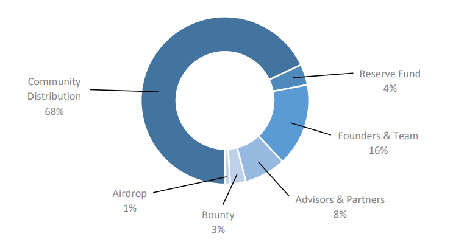

# GSTAR.AI Crowdsale Contracts

Refer below for more information about [GStar's Crowdsale][gstar.ai] and the crowdsale smart contracts.


## Overview

## Contracts

## Crowdsale Specification
* GSTAR token is ERC-20 compliant.
* GSTAR token is hardcapped at 1.6 billion tokens.
* GSTAR token is non-mintable.
* Any excess token will be burned off by the owner at the end of the crowdsale.
* GSTAR tokens will be released only after the crowdsale ends.
* Contributors are required to be whitelisted.

### Token Distribution



## GSTAR Bonus Structure

| Period | Bonus Tokens |
| :---: | :---: |
| Pre-ICO | 20% |
| ICO Day 1 | 15% |
| ICO Day 2 to Day 3 | 12% |
| ICO Day 4 to Day 7 | 8% |
| ICO Week 2 | 4% |
| ICO Week 3 | 2% |
| ICO Week 4 | No Bonus |

## Development Framework

* The contracts are written in [Solidity][solidity] and tested using [Truffle][truffle] version [4.1.0][truffle_v4.1.0] and [Ganache CLI][ganache].
* The smart contracts are based on [OpenZeppelin][openzeppelin] framework version [1.7.0][openzeppelin_v1.7.0].

## Smart Contracts Functions

### GSTAR Tokens Function

**burn**
```javascript
function burn(uint256 _value) public onlyOwner
```
Allows owner to burn GSTAR tokens.

### GSTAR Crowdsale

**fallback function**
```javascript
function () public payable
```

**buyTokens**
```javascript
function buyTokens(address beneficiary) public payable
```

**getRate**
```javascript
function getRate() public view returns (uint256)
```

**updateFundingGoal**
```javascript
function updateFundingGoal() internal returns (bool)
```

**isFundingGoalReached**
```javascript
function isFundingGoalReached() public view returns (bool)
```

**isCrowdsaleActive**
```javascript
function isCrowdsaleActive() public view returns (bool)
```

**validPurchase**
```javascript
function validPurchase() internal view returns (bool)
```

**startCrowdsale**
```javascript
function startCrowdsale() public onlyOwner
```

**stopCrowdsale**
```javascript
function stopCrowdsale() public onlyOwner
```

**claimTokens**
```javascript
function claimTokens() public
```

**claimRefund**
```javascript
function claimRefund() public
```

**enableSettlement**
```javascript
function enableSettlement() public onlyOwner
```

**endSettlement**
```javascript
function endSettlement() public onlyOwner
```

**addToWhitelist**
```javascript
function addToWhitelist(address beneficiary) public onlyOwner
```

**removeFromWhitelist**
```javascript
function removeFromWhitelist(address beneficiary) public onlyOwner
```

**addManyToWhitelist**
```javascript
function addManyToWhitelist(address[] beneficiaries) public onlyOwner
```

**whitelistAndReleaseTokens**
```javascript
function whitelistAndReleaseTokens(address[] beneficiaries) public onlyOwner
```


### Dependencies
```
// Install truffle framework and initialize
$ npm install -g truffle
$ npm init

// Install ganache-cli which includes testrpc
$ npm install -g ganache-cli

// Install OpenZeppelin framework
$ npm install -E zeppelin-solidity

// Install node dependencies
$ npm install

// Install web3
$ npm install ethereum/web3.js
```


[gstar.ai]: https://gstar.ai/
[solidity]: https://solidity.readthedocs.io/en/develop/#
[truffle]: http://truffleframework.com/
[truffle_v4.1.0]: https://github.com/trufflesuite/truffle/releases/tag/v4.1.0
[ganache]: https://github.com/trufflesuite/ganache-cli
[openzeppelin]: https://openzeppelin.org/
[openzeppelin_v1.7.0]: https://github.com/OpenZeppelin/zeppelin-solidity/releases/tag/v1.7.0
