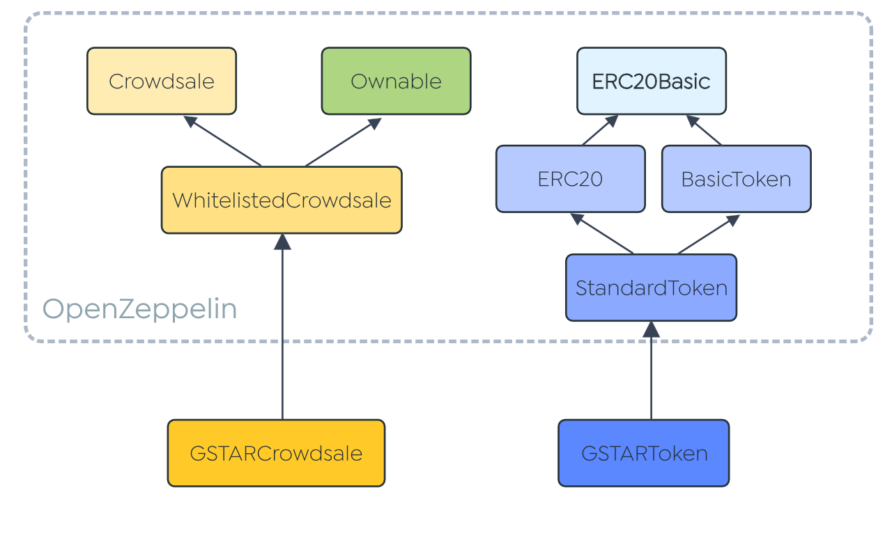

# GSTAR.AI Crowdsale Contracts

This repository explains the technical details regarding [GStar's Crowdsale][gstar.ai] and the crowdsale smart contracts involved.


GSTAR is an ERC-20 compliant cryptocurrency built on the Ethereum blockchain network.

## Overview

GStar Technologies aims to empower the masses to be able to use AI technologies in the fields of trading, thus leveling the playing field that had largely kept profitable trading out of reach of the masses. This further fuels the gig economy, where people can now earn a living based on their own terms as traditional jobs gets disrupted in this new technological world.

GStar Technologies is holding a crowdsale for GSTAR Tokens which will be used to facilitate transactions on the GStar trading platform. The section below explains some of the technical details with regards to the crowdsale.

## Contracts

The contracts are located in the [contracts](contracts) directory.

## Crowdsale Specification

* GSTAR token is ERC-20 compliant.
* GSTAR token is hardcapped at 1.6 billion tokens.
* GSTAR token is non-mintable.
* Any excess token will be burned off by the owner at the end of the crowdsale.
* GSTAR tokens will be released only after the crowdsale ends.
* Contributors are required to be whitelisted.
* Funding goal is capped at 76,000 ETH.
* Presale goal is capped at 3,000 ETH and will only be effective during presale period.

### Token Distribution


## GSTAR Bonus Structure

| Period             | Bonus Tokens |
| :----------------: | :----------: |
| Pre-ICO            | 20%          |
| ICO Day 1          | 15%          |
| ICO Day 2 to Day 3 | 12%          |
| ICO Day 4 to Day 7 | 8%           |
| ICO Week 2         | 4%           |
| ICO Week 3         | 2%           |
| ICO Week 4         | No Bonus     |

## Development Framework

* The contracts are written in [Solidity][solidity] and tested using [Truffle][truffle] version [4.1.3][truffle_v4.1.3] and [Ganache CLI][ganache].
* The smart contracts are based on [OpenZeppelin][openzeppelin] framework version [1.7.0][openzeppelin_v1.7.0].

## Smart Contracts Code

### Class Diagram

The diagram below shows the inheritance relationship between the contracts used to create the GSTAR Crowdsale contract and the GSTAR Token contract.



### GSTAR Token Functions

##### burn

```javascript
function burn(uint256 _value) public onlyOwner
```

Allows owner to burn GSTAR tokens.

### GSTAR Crowdsale Functions

##### _preValidatePurchase

```javascript
function _preValidatePurchase(address _beneficiary, uint256 _weiAmount) internal isWhitelisted(_beneficiary)
```

Overrode the function from Crowdsale.sol from OpenZeppelin. Check if the contribution is valid before the actual contribution is made. The following checks are made:

* Contribution is within crowdsale period.
* Crowdsale is active.
* Contributor and beneficiary are the same address.
* Contribution does not exceed funding goal.
* Contribution does not exceed presale goal amount during presale period.
* Contribution is at least of minimum amount.
* Contributor is whitelisted.

##### _getTokenAmount

```javascript
function _getTokenAmount(uint256 _weiAmount) internal view returns (uint256)
```

Returns the token amount based on the ETH contributed.

##### getRate

```javascript
function getRate() public view returns (uint256)
```

Returns the number of GSTAR tokens per ETH sent. The rate varies accordingly with the mentioned bonus structure.

##### _updatePurchasingState

```javascript
function _updatePurchasingState(address _beneficiary, uint256 _weiAmount) internal
```

Updates the token amount attributed to the contributor based on the ETH contributed, then updates funding goal.

##### updateFundingGoal

```javascript
function updateFundingGoal() internal
```

Updates if the funding goal is reached. If the funding goal is reached, no more purchase of tokens is allowed.

##### changePrivateContribution

```javascript
function changePrivateContribution(uint256 etherWeiAmount) external onlyOwner
```

Allows owner to change the private contribution amount. This amount is included in the calculation of the funding goal.

##### startCrowdsale

```javascript
function startCrowdsale() external onlyOwner
```

Allows owner to start/unpause crowdsale.

##### stopCrowdsale

```javascript
function stopCrowdsale() external onlyOwner
```

Allows owner to stop/pause crowdsale.

##### releaseTokens

```javascript
function releaseTokens(address[] contributors) external onlyOwner
```

Release tokens to the addresses in put based on the recorded tokens amount for each contributor.

##### close

```javascript
function close() external onlyOwner
```

Allows owner to stop crowdsale, then transfers any remaining tokens in the contract back to the owner. This also prevents any tokens being stuck in the contract.

##### addToWhitelist

```javascript
function addToWhitelist(address _beneficiary) external onlyOwner
```

Inherited from WhitelistedCrowdsale.sol from OpenZeppelin. Allows owner to whitelist a single address.

##### removeFromWhitelist

```javascript
function removeFromWhitelist(address _beneficiary) external onlyOwner
```

Inherited from WhitelistedCrowdsale.sol from OpenZeppelin. Allows owner to remove a single address from the whitelist.

##### addManyToWhitelist

```javascript
function addManyToWhitelist(address[] _beneficiaries) external onlyOwner
```

Inherited from WhitelistedCrowdsale.sol from OpenZeppelin. Allows owner to whitelist multiple addresses.

### GSTAR Crowdsale Contract Events

##### TokenPurchase 

```javascript
event TokenPurchase(address indexed purchaser, address indexed beneficiary, uint256 value, uint256 amount);
```

##### GoalReached

```javascript
event GoalReached(uint256 totalEtherAmountRaised);
```

##### StartCrowdsale

```javascript
event StartCrowdsale();
```

##### StopCrowdsale

```javascript
event StopCrowdsale();
```

##### ReleaseTokens

```javascript
event ReleaseTokens(address[] _beneficiaries);
```

##### Close

```javascript
event Close();
```


### Dependencies

```
// Install truffle framework and initialize
$ npm install -g truffle

// Install ganache-cli which includes testrpc
$ npm install -g ganache-cli

// Install node dependencies
$ npm install

// Install web3
$ npm install ethereum/web3.js
```


[gstar.ai]: https://gstar.ai/
[solidity]: https://solidity.readthedocs.io/en/develop/#
[truffle]: http://truffleframework.com/
[truffle_v4.1.3]: https://github.com/trufflesuite/truffle/releases/tag/v4.1.3
[ganache]: https://github.com/trufflesuite/ganache-cli
[openzeppelin]: https://openzeppelin.org/
[openzeppelin_v1.7.0]: https://github.com/OpenZeppelin/zeppelin-solidity/releases/tag/v1.7.0
